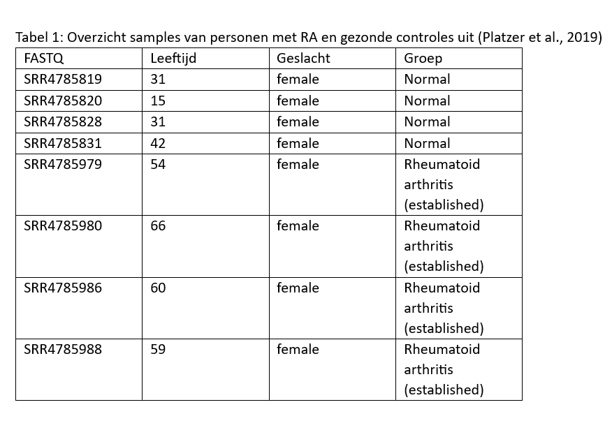
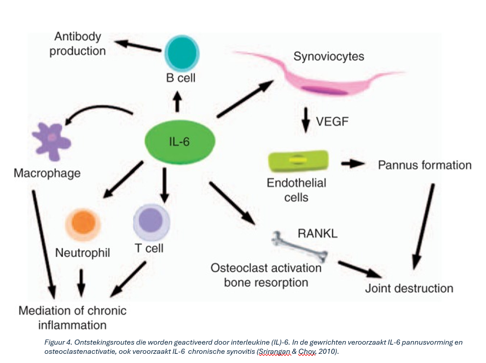

# Ontregeling van cytokine- en chemokinesignalering wordt geassocieerd met ontstekingsreacties die kenmerkend zijn voor reumatoïde artritis

## Inhoud
- `AI-disclaimer`- uitleg waarvoor AI gebruikt is. 
- `Assets`- afbeeldingen ter ondersteuning van de resultaten
  uit wetenschappelijke bronnen. 
- `Bronnen`- gebruikte bronnen. 
- `Data`- gebruikte data voor de analyses.
- `Data_Stewardship`- hier wordt uitgelegd hoe de data en GitHub pagina beheerd is.
- `Methode`- flowschema met meer gedetailleerde uitwerking van de methode.  
- `Resultaten`- de visualisaties van significante resultaten.
- `Scripts`- scripts voor verschillende analyses 
- `README.md`- het document waarin de tekst staat gegenereerd. 

## Inleiding
Reumatische arthritis (RA) is een auto-immuunziekte waarvan het immuunsysteem, het synovium of het slijmvlies van het gewrichtskapsel in het hele lichaam aanvalt. Het veroorzaakt ontsteking van de gewrichten en kan in ernstige gevallen leiden tot blijvende gewrichtsschade en invaliditeit. Daarnaast kan RA ook andere organen aantasten. RA komt wereldwijd voor bij ongeveer 1 op de 200 volwassenen en treft vrouwen 2 tot 3 keer vaker dan mannen. De ziekte kan op elke leeftijd ontstaan, maar komt het vaakst voor tussen de 50 en 59 jaar (Smith & Berman, 2022).

Door een verlies van immuuntolerantie ontstaan auto-antistoffen, zoals ACPA en reumafactor (RF), die een ontstekingsreactie op gang brengen (Mauri & Ehrenstein, 2007). Hierbij worden T-cellen, B-cellen en macrofagen geactiveerd (Tran et al., 2005), die ontstekingsstoffen (cytokinen) zoals TNF-α, IL-6 en IL-1 produceren (McInnes & Schett, 2007). Deze chronische ontsteking van het synovium (de gewrichtsbekleding) leidt uiteindelijk tot beschadiging van kraakbeen en bot, wat pijn, stijfheid en functieverlies van de gewrichten veroorzaakt (Amaya-Amaya et al., 2013). 

Met transcriptomics kan de expressie van duizenden genen tegelijkertijd worden onderzocht. Door genexpressie tussen reumapatiënten en gezonde controles te vergelijken, kunnen genen worden geïdentificeerd die verschillend tot expressie komen. Met een Gene Ontology (GO)-analyse kan vervolgens worden onderzocht bij welke biologische processen, moleculaire functies en cellulaire componenten deze genen betrokken zijn. Een KEGG-pathwayanalyse kan daarnaast inzicht geven in de signaalroutes waarin deze genen voorkomen.

Het doel van dit onderzoek is daarom om met behulp van genexpressieanalyse, GO-analyse en KEGG-pathwayanalyse inzicht te krijgen in de biologische processen en signaalroutes die verschillen tussen reumapatiënten en gezonde controles. Hierbij wordt onderzocht welke genen significant verschillend tot expressie komen, welke biologische processen en immuunfuncties hierbij betrokken zijn en welke KEGG-pathway het meest relevant is. Vervolgens wordt gekeken naar de meest opvallende genen binnen deze pathway en welke rol deze genen mogelijk spelen bij reumatoïde artritis.

Het doel van dit onderzoek is om met behulp van genexpressieanalyse, GO-analyse en KEGG-pathwayanalyse inzicht te krijgen in welke biologische processen en signaalroutes een grote rol spelen bij reumatoïde artritis (RA) in vergelijking met gezonde controles.
Welke genen komen significant verschillend tot expressie tussen reumapatiënten en gezonde controles?
Welke biologische processen, moleculaire functies en cellulaire componenten zijn significant en komen het meest voor in de dataset 
onder de genen die een veranderende expressie laten zien in RA in vergelijking tot gezonde controles?
Welke KEGG-pathway is betrokken bij de gevonden verschillen in genexpressie?
Welke rol spelen de meest opvallende genen binnen dit pathway bij reumatoïde artritis? 

## Methode
RNA-seq data afkomstig van vier gezonde controles en vier patiënten met established reumatoïde artritis afkomstig uit (Platzer et al., 2019) werden geanalyseerd in R. Sequencing reads werden gemapt op het humane referentiegenoom (GRCh38) ((Accession GCF_000001405.40), gedownload uit de NCBI Genome Database)(Schneider et al., 2017) met behulp van het Rsubread-pakket versie 2.24.0 (Liao et al., 2019). Vervolgens werd het aantal reads per gen bepaald met featureCounts, waarna een count matrix werd opgesteld. Differentiële genexpressie tussen de RA- en controlegroep werd bepaald met DESeq2 package versie 1.50.2 (Love et al., 2014). Significante verschillen in genexpressie werden gevisualiseerd met een volcano plot (EnhancedVolcano) met package versie 1.28.2 (Blighe et al., 2026). Vervolgens werd een Gene Ontology-analyse uitgevoerd met goseq package versie 1.62.0 (Young et al., 2010) om betrokken biologische processen te identificeren. Ten slotte werd een KEGG pathway-analyse uitgevoerd met behulp van KEGGREST package versie 1.50.0 (Kanehisa & Goto, 2000), en pathview versie 1.50.0 (Luo & Brouwer, 2013) om relevante signaalroutes in kaart te brengen in pathway hsa04060. De methode is [hier](Methode/FlowshemaRA.png) in meer detail uitgewerkt in een overzichtelijke flowschema.

  

## Resultaten
Om de genen die differentieel tot expressie kwamen te visualiseren was gebruik gemaakt van een vulcanoplot. Daarna was de GO-analyse gedaan om in kaart te brengen welke biologische processen, moleculaire functies of cellulaire componenten betrokken waren bij de genen die in de gebruikte dataset een veranderde expressie lieten zien. Ook was er een KEGG-analyse gedaan van pathway hsa04060 die betrekking had tot de uitkomst van de GO-analyse. 

De [vulcanoplot](Resultaten/VulcanoplotRA.png) liet zien dat er veel genen waren waarvan de expressie het meest verschillend was tussen reumapatiënten en gezonde controles (rode punten). Zowel aan de linker als rechterkant bevinden zich significante genen, wat betekent dat sommige genen verhoogd en andere verlaagd tot expressie kwamen bij RA-patienten.

De [Gene Ontology (GO)- analyse](Resultaten/GO-analyseplot.png) liet zien dat de differentieel geëxpresseerde genen voornamelijk betrokken waren bij imuungerelateerde processen. De meest significante GO-termen waren onder andere immune system process, immune response, lymphocyte mediated immunity en adaptive immune respons. Deze resultaten lieten zien dat veranderingen in de expressie van genen tussen reumapatienten en gezonde controles vooral te maken hadden met activatie van het immuunsysteem. 

DE KEGG-analyse van de cytokine-cytokine receptor interactie pahtway [(hsa04060)](Resultaten/hsa04060.pathview.2png.png) liet zien dat er meerdere types cytokinen zowel sterk verlaagd als verhoogd tot expressie kwmamen, met name vele type chemokines waaronder CXCL1, CXCL5, CXCL6, CXCL8 en CXCL13 waren sterk verhoogd tot expressie gekomen. Daarnaast werden verhoogde expressieniveaus waargenomen voor verschillende cytokinen, waaronder IL6, IL1A en IL1B. Bij slechte weergave is hier de [pathway](Resultaten/hsa04060.pathview.png) beter zichtbaar zonder bijschrift. De functies van de chemokines en cytokines in RA staan beschreven in deze [tabel](Resultaten/GenenRAJ2P4.pdf). 

  

## Conclusie

Het doel van het onderzoek was om met behulp van genexpressieanalyse, GO-analyse en KEGG-pathwayanalyse inzicht te krijgen in welke biologische processen en signaalroutes een grote rol spelen bij reumatoïde artritis (RA) in vergelijking met gezonde controles. De genexpressieanalyse liet zien dat meerdere genen significant verschillend tot expressie kwamen tussen reumapatiënten en gezonde controles. Op basis van de GO-analyse en KEGG-analyse kan worden geconcludeerd dat immuun- en ontstekingsgerelateerde processen een belangrijke rol spelen bij reumatoïde artritis. Deze bevindingen werden ondersteund door de KEGG-analyse van de pathway Cytokine-cytokine receptor interaction (hsa04060). Binnen deze pathway werden meerdere cytokinen en chemokinen, waaronder IL6, IL1B, CXCL8 en CXCL13 verhoogd tot expressie gebracht. Dit suggereert dat ontregeling van cytokine- en chemokinesignalering bijdraagt aan de ontstekingsreacties die kenmerkend zijn voor reumatoïde artritis.

## Data Stewardship

In [dit document](Data_Stewardship/DataStewardship_GitHub.pdf) wordt uitgelegd hoe de data en GitHub pagina beheerd is. 

## AI-disclaimer 
In dit [document](AI-disclaimer/AI-dislaimer_GitHubRA.pdf) staat hoe AI gebruikt is. 
